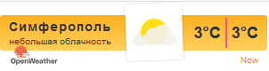
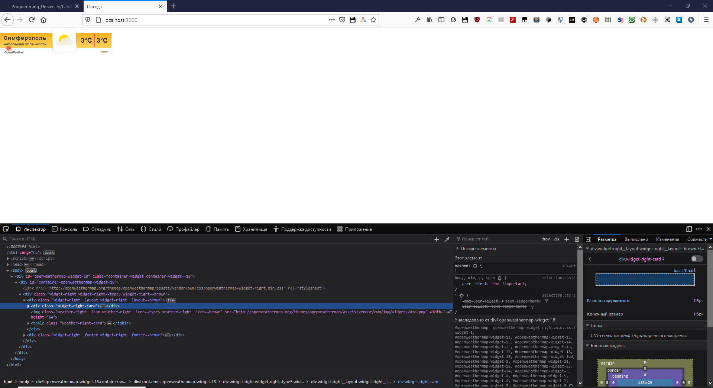

<p align="center">МИНИСТЕРСТВО НАУКИ  И ВЫСШЕГО ОБРАЗОВАНИЯ РОССИЙСКОЙ ФЕДЕРАЦИИ<br>
Федеральное государственное автономное образовательное учреждение высшего образования<br>
"КРЫМСКИЙ ФЕДЕРАЛЬНЫЙ УНИВЕРСИТЕТ им. В. И. ВЕРНАДСКОГО"<br>
ФИЗИКО-ТЕХНИЧЕСКИЙ ИНСТИТУТ<br>
Кафедра компьютерной инженерии и моделирования</p>
<br>
<h3 align="center">Отчёт по лабораторной работе № 1<br> по дисциплине "Программирование"</h3>
<br><br>
<p>студента 1 курса группы ПИ-б-о-202(2)<br>
Абдураманов Ибраим Арсенович<br>
направления подготовки 09.03.01 "Программная инженерия"</p>
<br><br>
<table>
<tr><td>Научный руководитель<br> старший преподаватель кафедры<br> компьютерной инженерии и моделирования</td>
<td>(оценка)</td>
<td>Чабанов В.В.</td>
</tr>
</table>
<br><br>
<p align="center">Симферополь, 2020</p>
<hr>

## Постановка задачи

Разработать сервис предоставляющий данные о погоде в городе Симферополе на момент запроса.  В качестве источника данных о погоде используйте: http://openweathermap.org/. В состав сервиса входит: серверное приложение на языке С++ и клиентское приложение на языке Python.

Серверное приложение (далее Сервер) предназначенное для обслуживания клиентских приложений и минимизации количества запросов к сервису openweathermap.org. Сервер должен обеспечивать возможность получения данных в формате JSON и виде html виджета (для вставки виджета на страницу будет использоваться iframe).

Клиентское приложение должно иметь графический интерфейс отображающий сведения о погоде и возможность обновления данных по требованию пользователя.

## Цель работы
Целью работы является научится создавать приложения с клиент-серверной архитектурой.

Каталоги:
[[Сервер]](./Server) [[Клиент]](./Client)
## Выполнение работы

Для начала нужно было ознакомиться с API, предоставляемыми сервисами openweathermap и worldtimeapi. Была прочитана документация и созданы требуемые запросы.

Следующим шагом был разработан сервер. Требовалось создать обработчики на два пути:

1. Разработка обработчика на путь "/"
2. Разработка обработчика на путь "/raw"

Для достижения высокой читабельности повторяющийся код был выделен в отдельные функции и заголовочные файлы, которые помещены по пути [[Common]](./Server/include/common)

Файл [University.cpp](./Server/University.cpp) содержит функцию входа *main*.

Во время работы сервера в консоль выводится отладочная информация о статусе запросов, сигнализирующая о возможных неполадках с web-сервисами.

### Информация о проекте

Для разработки сервера был использована IDE Visual Studio последней версии и соответсвующий ей компилятор MSVC.

Для разработки клиента был использован язык программирования Python версии 3.8.6.

### Обязательная информация

1. На сайте openweathermap.org был получен следующий ключ api: **d6b985e0b0ff610fc0381d36d264bff2**
2. Был составлен следующий запрос для пункта 1.7: http://api.openweathermap.org/data/2.5/onecall?lat=44.957191&lon=34.11079&exclude=current,minutely,daily,alerts&units=metric&lang=ru&appid=d6b985e0b0ff610fc0381d36d264bff2
3. Был составлен следующий запрос для пункта 2: http://worldtimeapi.org/api/timezone/Europe/Simferopol
4. Полный исходный код сервера:
```c++
// -------
// <COMMON>
// -------

// -------
// <utils.hpp>
// -------

#pragma once
#include <string>

void replace(std::string& str, const std::string& from, const std::string& to)
{
	size_t position = str.find(from);
	while (position != std::string::npos)
	{
		str.replace(position, from.size(), to);
		position = str.find(from, position + to.size());
	}
}

bool is_empty(std::ifstream& stream)
{
	return stream.peek() == std::ifstream::traits_type::eof();
}

// -------
// <directory.hpp>
// -------

#pragma once
#include "direct.h"

#include <cstring>
#include <string>
#include <iostream>

inline std::string get_executable_directory(const char** argv)
{
	const std::string path = argv[0];
	const size_t path_directory_index = path.find_last_of('\\');
	return path.substr(0, path_directory_index + 1);
}

inline bool change_directory(const char* dir)
{
	return _chdir(dir) == 0;
}

inline std::string get_current_working_directory()
{
	const int buffer_size = 4096;
	char buf[buffer_size];
	memset(buf, 0, buffer_size);
	_getcwd(buf, buffer_size - 1);
	return buf;
}

// -------
// <time.hpp>
// -------

#pragma once
#include <cpp_httplib/httplib.h>
#include <nlohmann/json.hpp>

static httplib::Client time_zone_api("http://worldtimeapi.org");

bool try_get_time(std::string& str)
{
	httplib::Result request = time_zone_api.Get("/api/timezone/Europe/Simferopol");

	if (request)
	{
		if (request->status == 200 || request->status == 203)
		{
			str = request->body;
			return true;
		}

		std::cerr << "Time status code: " << request->status << std::endl;
	}
	else
	{
		std::cerr << "Time error code: " << request.error() << std::endl;
	}

	return false;
}

static int unix_time = -1;

bool try_get_time_json(nlohmann::json& json)
{
	std::string str;
	if (try_get_time(str))
	{
		json = nlohmann::json::parse(str);
		return true;
	}

	return false;
}

bool try_get_current_unix_time(time_t& current)
{
	nlohmann::json json;
	if (!try_get_time_json(json))
	{
		current = std::time(nullptr);
		return false;
	}

	current = json["unixtime"].get<time_t>();
	return true;
}

// -------
// <weather.hpp>
// -------

#pragma once
#include <string>
#include <cpp_httplib/httplib.h>
#include <nlohmann/json.hpp>

#include "utils.hpp"
#include "time.hpp"

using namespace httplib;

static Client weather_api("http://api.openweathermap.org");

static const std::string request_str = "/data/2.5/onecall?lat=44.957191&lon=34.11079&exclude=current,minutely,daily,alerts&units=metric&lang=ru&appid=5ced5dc06c1e4991ac7b402ab6426e01";

bool try_get_weather_request(std::string& str)
{
	Result request = weather_api.Get(request_str.c_str());

	if (request)
	{
		if (request->status == 200 || request->status == 203)
		{
			str = request->body;
			return true;
		}

		std::cerr << "Weather status code: " << request->status << std::endl;
	}
	else
	{
		std::cerr << "Weather error code: " << request.error() << std::endl;
	}

	return false;
}

bool try_get_weather_json_request(nlohmann::json& json)
{
	std::string str;
	if (try_get_weather_request(str))
	{
		replace(str, "\\\"", "\"");
		json = nlohmann::json::parse(str);
		return true;
	}

	return false;
}

static nlohmann::json cache;

bool try_read_cache_file()
{
	try
	{
		std::ifstream cache_stream("cache.json");

		const bool successful = cache_stream.is_open() && !is_empty(cache_stream);
		if (successful)
		{
			cache_stream >> cache;
		}

		cache_stream.close();
		return successful;
	}
	catch (nlohmann::json::parse_error&)
	{
		return false;
	}
}

bool try_write_cache_file(const nlohmann::json& json)
{
	if (json.empty())
	{
		return false;
	}

	std::ofstream cache_file("cache.json");
	cache_file << cache;
	cache_file.close();
	return true;
}

bool try_get_weather_json_internal(nlohmann::json& json, const time_t& current_time)
{
	if (cache != nullptr && !cache.empty())
	{
		json = cache;
	}
	else
	{
		if (!try_get_weather_json_request(json))
		{
			return false;
		}

		cache = json;

		try_write_cache_file(json);
	}
	
	nlohmann::json hourly = json["hourly"];

	const int size = hourly.size();

	if (hourly[size - 1]["dt"].get<time_t>() < current_time)
	{
		cache = nullptr;
		return try_get_weather_json_internal(json, current_time);
	}
	
	return !json.empty();
}

bool try_get_weather_json(nlohmann::json& json)
{
	time_t current_time;
	try_get_current_unix_time(current_time);
	
	return try_get_weather_json_internal(json, current_time);
}

bool try_get_hourly_weather_json(nlohmann::json& json)
{
	time_t current_time;
	try_get_current_unix_time(current_time);
	
	if (!try_get_weather_json_internal(json, current_time))
	{
		return false;
	}

	nlohmann::json hourly = json["hourly"];
	
	const int size = hourly.size();
	
	for (int i = 0; i < size - 1; ++i)
	{
		if (hourly[i]["dt"].get<time_t>() >= current_time)
		{
			json = hourly[i];
			break;
		}
	}

	return !json.empty();
}

bool try_get_out_weather_json(nlohmann::json& json)
{
	if (!try_get_hourly_weather_json(json))
	{
		return false;
	}

	nlohmann::json out;
	out["temp"] = json["temp"];
	out["description"] = json["weather"][0]["description"];

	json = out;
	return !json.empty();
}

// -------
// <template.hpp>
// -------

#pragma once
#include <fstream>
#include <iostream>
#include <ostream>
#include <string>

#include <nlohmann/json.hpp>

#include "common/utils.hpp"

bool try_read_template(const std::string& path, std::string& temp)
{
	std::ifstream file(path.c_str());
	if (file.is_open() && !is_empty(file))
	{
		std::getline(file, temp, '\0');
		file.close();
		return true;
	}

	file.close();
	return false;
}

static std::string _template;

bool try_reload_template(std::string& temp)
{
	if (try_read_template("template.html", temp))
	{
		_template = temp;
		return true;
	}

	return false;
}

bool try_read_template(std::string& temp)
{
	if (!_template.empty())
	{
		temp = _template;
		return true;
	}
	
	return try_reload_template(temp);
}

bool try_set_template(const nlohmann::json& json, const std::string& temp, std::string& result)
{
	try
	{
		result = temp;
		
		replace(result, "{description}",
			json["weather"][0]["description"]);

		replace(result, "{icon}", json["weather"][0]["icon"]);

		replace(result, "{temp}",
			std::to_string(static_cast<int>(std::round(json["temp"].get<double>()))));

		return true;
	}
	catch (const std::exception&)
	{
		return false;
	}
}

bool try_set_template(const nlohmann::json& json, std::string& result)
{
	std::string temp;
	return try_read_template(temp) && try_set_template(json, temp, result);
}

bool try_read_and_set_template(const nlohmann::json& json, const std::string& path, std::string& result)
{
	std::string temp;
	return try_read_template(path, temp) && try_set_template(json, temp, result);
}

// -------
// <MAIN>
// -------

// -------
// <university.cpp>
// -------

#include <ctime>
#include <iostream>
#include <iomanip>
#include <string>

#include <cpp_httplib/httplib.h>
#include <nlohmann/json.hpp>

#include <common/directory.hpp>
#include <common/weather.hpp>
#include <common/template.hpp>

using namespace httplib;

#define UTF8 "text/html;charset=utf-8"
#define UTF8JSON "application/json;charset=utf-8"

std::string current_dir;
std::string executable_dir;

void generate_widget_response(const Request& req, Response& res)
{
	nlohmann::json json;
	if (try_get_hourly_weather_json(json))
	{
		std::string result;

		const std::string path = current_dir + "\\" + "template.html";
		
		if (try_set_template(json, result) || try_read_and_set_template(json, path, result))
		{
			res.set_content(result, UTF8);
			return;
		}

		res.set_content("Шаблон: \"" + path + "\" недоступен." , UTF8);
		res.status = 503;
		return;
	}

	res.set_content("Неизвестная ошибка!", UTF8);
	res.status = 503;
}

void generate_response(const Request& req, Response& res, const std::function<bool(nlohmann::json&)>& generator)
{
	nlohmann::json json;
	if (generator(json))
	{
		res.set_content(json.dump(), UTF8JSON);
		return;
	}

	res.set_content("Неизвестная ошибка!", UTF8);
	res.status = 503;
}

void generate_raw_response(const Request& req, Response& res)
{
	return generate_response(req, res, try_get_out_weather_json);
}

void generate_hourly_response(const Request& req, Response& res)
{
	return generate_response(req, res, try_get_hourly_weather_json);
}

void generate_full_response(const Request& req, Response& res)
{
	return generate_response(req, res, try_get_weather_json);
}

int main(int argc, const char** argv)
{
	setlocale(LC_ALL, "Russian");

	try_read_cache_file();

	current_dir = get_current_working_directory();
	executable_dir = get_executable_directory(argv);
	change_directory(executable_dir.c_str());
	
	Server svr;

	svr.Get("/", generate_widget_response);
	svr.Get("/raw", generate_raw_response);
	svr.Get("/hourly", generate_hourly_response);
	svr.Get("/full", generate_full_response);

	std::cout << "Start server... OK" << std::endl;
	
	svr.listen("localhost", 3000);
	
	return 0;
}
```
5. Полный код Клиента:
```py
#!/usr/bin/python
# -*- coding: utf-8 -*-

from tkinter import Tk, Frame, BOTH, TOP, BOTTOM, X, Y, Label
import json
import requests
import asyncio
import threading

import warnings
warnings.filterwarnings("ignore")


def center(win):
    win.update_idletasks()
    width = win.winfo_width()
    frm_width = win.winfo_rootx() - win.winfo_x()
    win_width = width + 2 * frm_width
    height = win.winfo_height()
    title_bar_height = win.winfo_rooty() - win.winfo_y()
    win_height = height + title_bar_height + frm_width
    x = win.winfo_screenwidth() // 2 - win_width // 2
    y = win.winfo_screenheight() // 2 - win_height // 2
    win.geometry('{}x{}+{}+{}'.format(width, height, x, y))
    win.deiconify()


def _asyncio_thread(loop, function):
    try:
        loop.run_until_complete(function)
    except RuntimeError:
        pass


def do_async(function):
    threading.Thread(target=_asyncio_thread, args=(async_loop, function)).start()


def get_request() -> str:
    try:
        return requests.get('http://localhost:3000/raw').content.decode("utf8")
    except requests.exceptions.ConnectionError:
        return None


async def get_request_async() -> str:
    return get_request()


def get_json():
    try:
        data = get_request()
        return json.loads(data) if data is not None else None
    except Exception:
        return None


async def get_json_async():
    return get_json()


def update_gui(data):
    if data is None:
        desc_label.config(text="Нет данных.")
        temp_label.config(text="")
        return

    desc_label.config(text=str(data["description"]))
    temp_label.config(text=str(data["temp"]) + "°C")


async def on_form_click_async(event):
    data = await get_json_async()
    update_gui(data)


def on_form_click_callback(event):
    try:
        do_async(on_form_click_async(event))
    except RuntimeError:
        pass


tick_cooldown = 30000


def tick_callback():
    root.after(tick_cooldown, tick_callback)
    return on_form_click_callback(None)


yellow = "#ffbb50"
white = "#ffffff"

if __name__ == '__main__':
    async_loop = asyncio.get_event_loop()
    root = Tk()
    root.title("Погода")
    root.resizable(0, 0)
    root.pack_propagate(0)

    root.bind("<Button-1>", on_form_click_callback)

    w = 250
    h = 170
    root.geometry(f"{w}x{h}")

    top_frame = Frame(root, bg=yellow, width=w, height=h * 0.2)
    middle_frame = Frame(root, bg=white, width=w, height=h * 0.6)
    bottom_frame = Frame(root, bg=yellow, width=w, height=h * 0.2)

    top_frame.pack(side=TOP, fill=X)
    middle_frame.pack(expand=True, fill=BOTH)
    bottom_frame.pack(side=BOTTOM, fill=X)

    city_label = Label(top_frame, font=("Calibri Bold", 12), text="Симферополь", bg=yellow)
    desc_label = Label(top_frame, font=("Calibri", 12), bg=yellow)
    temp_label = Label(middle_frame, font=("Impact", 48), bg="#ffffff")

    city_label.pack(pady=0)
    desc_label.pack(pady=0)
    temp_label.pack(expand=True)

    root.after(0, tick_callback)

    center(root)
    root.mainloop()
```
6. Скриншот клиентского приложения:


7. Скриншот браузерного виджета:






Каталоги:
[[Сервер]](./Server) [[Клиент]](./Client)
## Вывод
Были выполнены все поставленные задачи, а также достигнута цель данной работы - была разработка клиент-серверного приложения позволяющего узнать погоду в Симферополе на текущий момент времени.

Разработка сервера была выполнена с использованием сторонних библиотек: json для работы с json и cpp-httplib для работы с http запросами. Клиент использует такие библиотеки как: requests - для отправки запросов, tkinter - для создания графического пользовательского интерфейса, threading и asyncio для асинхронного программирования, и другие.